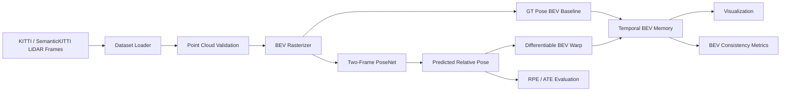

# NeuralBEV-LO Execution Plan

> **For future agentic workers:** execute this plan task by task in `E:\AAAworkspace\study\NeuralBEV-LO`. Do not skip validation, do not expand scope without user approval, and keep every phase independently runnable.

**Project name:** NeuralBEV-LO  
**Full title:** Learning-based LiDAR Odometry for Streaming 4D BEV Mapping  
**Target workspace:** `E:\AAAworkspace\study\NeuralBEV-LO`  
**Git repository:** `git@github.com:2025wwzx/NeuralBEV-LO.git`  
**Visibility:** open-source project  
**Target hardware:** Intel Core Ultra 9 285K, RTX 5080, 64GB DDR5  
**Primary goal:** build a resume-ready research prototype that converts sequential LiDAR frames into a streaming 4D BEV memory using learned relative pose estimation and temporal BEV warping.  
**Current state:** this workspace currently contains only this plan. Week 1 must create the project skeleton, connect local git to the existing open-source remote repository when initializing, and make the first smoke test pass before any modeling work starts.  

---

## 1. Project Positioning

This is a learning and research project, not a production autonomous-driving stack. The deliverable should prove that the user can design and implement a complete LiDAR temporal mapping pipeline:

1. Read sequential LiDAR frames and calibration/pose metadata.
2. Convert point clouds into BEV tensors.
3. Build a ground-truth-pose BEV accumulation baseline.
4. Train a lightweight learning-based odometry model.
5. Use predicted relative pose to warp and update temporal BEV memory.
6. Evaluate trajectory error and BEV accumulation quality.
7. Produce visualizations, metrics, and a concise technical report suitable for a resume/GitHub project.

The project should start from KITTI Odometry. SemanticKITTI can be added later for semantic labels. nuScenes/OpenOccupancy are explicitly later-stage, not Phase 1 dependencies.

### Milestone Strategy

The plan is optimized around four independently demonstrable milestones:

| Milestone | Target | Minimum proof |
| --- | --- | --- |
| M0: Reproducible skeleton | End of Week 1 | Fresh environment imports `neuralbev_lo`, pytest smoke test passes |
| M1: Data-to-BEV baseline | End of Week 4 | One KITTI sequence produces single-frame BEV and GT-pose accumulated BEV figures |
| M2: Learned odometry loop | End of Week 7 | PoseNet trains on a tiny subset, saves checkpoint, beats zero-motion on validation |
| M3: Streaming BEV demo | End of Week 12 | One command emits metrics, figures, video, and a short final report |

Every later task should preserve the previous milestone's command path. If a change breaks an earlier milestone, fixing that regression has priority over adding new features.

---

## 2. Non-Goals

Do not start with these:

- Full 3D sparse Transformer over long sequences.
- Large-scale multi-camera/multi-LiDAR fusion.
- Full self-supervised pose learning without teacher pose.
- Global HD map reconstruction over kilometers.
- Real-time vehicle deployment.
- ROS integration.
- CUDA custom kernels.
- Loop closure or global bundle adjustment.

These are interesting research extensions, but they will slow down the first resume-ready result.

---

## 3. Recommended Architecture



Core design choice:

- Use 3DoF first: `dx`, `dy`, `yaw`.
- Add 6DoF only after the 3DoF pipeline is stable.
- Use BEV tensors first, not raw 3D sparse conv.
- Use short temporal windows first: `K=3` or `K=5`.
- Use ground-truth pose as a teacher and as an upper-bound baseline.

### Engineering Contracts

These contracts must be documented and tested early. Future agents should not infer them from scattered implementation details.

| Contract | Required decision | First validation |
| --- | --- | --- |
| KITTI data layout | `data/kitti_odometry/sequences/<seq>/velodyne`, `calib.txt`, `times.txt`, and `poses/<seq>.txt` or an equivalent configured root | `prepare_kitti.py` and `preview_sequence.py` print counts, first/last timestamps, and first pose |
| KITTI pose source | KITTI Odometry `poses.txt` is camera-frame pose, commonly `T_world_cam0`; convert to internal LiDAR pose with `Tr_velo_to_cam` from `calib.txt` | Calibration fixture verifies `T_world_cam0`, `Tr_velo_to_cam`, and `T_world_lidar` conversion |
| Pose convention | Use homogeneous `T_world_lidar` internally after KITTI calibration conversion; adjacent label is `T_prev_curr = inv(T_world_prev) @ T_world_curr` | Synthetic SE(2)/SE(3) composition tests |
| 3DoF label frame | `dx`, `dy`, `yaw` are expressed in the previous LiDAR/BEV frame unless a config explicitly says otherwise | Known transform fixture recovers expected `dx`, `dy`, `yaw` |
| BEV grid | x forward, y left, origin and pixel indexing are fixed in config; row/column mapping is documented | Hand-built point fixture maps to expected cells |
| Warp direction | Memory warp uses the inverse transform needed by `grid_sample`; sign is tested before KITTI demos | Synthetic square/line warp test |
| Artifact output | Commands save figures, videos, metrics, checkpoints, and logs under `outputs/` with run ids | Smoke command prints artifact paths |
| Reproducibility | Config, seed, git state if available, device, PyTorch/CUDA versions are logged | Training/eval log includes environment block |

Recommended `run_id` format:

```text
{experiment_name}_{YYYYMMDD_HHMMSS}
```

Every command that writes artifacts should print the resolved `run_id` and output directory.

---

## 4. Target Repository Structure

Create this structure after migrating to `E:\AAAworkspace\study\NeuralBEV-LO`:

```text
NeuralBEV-LO/
  README.md
  pyproject.toml
  .gitignore
  configs/
    dataset/kitti.yaml
    train/posenet_3dof.yaml
    eval/kitti_eval.yaml
  data/
    README.md
  docs/
    architecture.md
    coordinate_system.md
    data_contract.md
    experiment_log.md
    resume_notes.md
  notebooks/
    01_data_preview.ipynb
    02_bev_memory_preview.ipynb
  neuralbev_lo/
    __init__.py
    data/
      kitti_dataset.py
      pose_utils.py
      split.py
    geometry/
      se2.py
      se3.py
      transforms.py
    bev/
      rasterizer.py
      warp.py
      memory.py
    models/
      posenet.py
      losses.py
    training/
      train_posenet.py
      checkpoint.py
    eval/
      odometry_metrics.py
      bev_metrics.py
    viz/
      render_bev.py
      render_trajectory.py
      make_demo_video.py
    utils/
      config.py
      logging.py
      seed.py
  scripts/
    check_env.py
    prepare_kitti.py
    preview_sequence.py
    run_pipeline_smoke.py
    train_posenet_3dof.py
    eval_posenet.py
    build_bev_memory_demo.py
  tests/
    test_se2.py
    test_pose_utils.py
    test_bev_rasterizer.py
    test_bev_warp.py
    test_memory_update.py
  outputs/
    checkpoints/
    figures/
    logs/
    videos/
    metrics/
```

Use `data/` and `outputs/` as git-ignored runtime directories. Commit configs, source, tests, docs, and small sample metadata only.

---

## 5. Default Technical Choices

### Python Environment

- Python 3.10 or 3.11.
- PyTorch with CUDA support.
- NumPy, OpenCV, Matplotlib, tqdm, PyYAML.
- Open3D only for optional point-cloud visualization.
- Avoid `spconv`, `MinkowskiEngine`, or custom CUDA until the first full pipeline works.
- Before installing or training, log `python --version`, `nvidia-smi`, `python -c "import torch; print(torch.__version__, torch.cuda.is_available())"`, and the selected config path.
- Add `scripts/check_env.py` in Week 1 to print Python, PyTorch, CUDA availability, GPU name, device capability, package versions, and the active config root.
- Prefer a plain virtual environment first. Consider WSL2 only if Windows CUDA package compatibility blocks PyTorch or OpenCV setup.
- Do not hard-code a CUDA or PyTorch wheel until Week 1 diagnostics confirm the locally supported combination for RTX 5080. Document the tested install command in README after it works.
- Use `pathlib.Path` for all filesystem paths. The dataset root should come from `configs/dataset/kitti.yaml` or an environment variable such as `KITTI_ROOT`, never from a hard-coded absolute path.
- Keep `evo` optional. The project should have native lightweight RPE/ATE-style metrics first, then may call `evo` only if installation is reliable on the local platform.

### Default BEV Grid

Start conservative:

```text
x range: 0m to 70m
y range: -35m to 35m
resolution: 0.25m or 0.5m
channels: density, max_height, mean_height, intensity
```

If GPU memory is tight:

1. Use resolution `0.5m`.
2. Use batch size `2`.
3. Use temporal window `K=3`.
4. Use mixed precision.
5. Reduce channels before reducing data quality.

### Training Defaults

```text
task: adjacent-frame relative pose
first target: dx, dy, yaw
input: BEV_t-1 and BEV_t stacked by channel
loss: weighted SmoothL1 for dx, dy, yaw
optimizer: AdamW
batch size: 4 initially, adjust by VRAM
epochs: short smoke training first, then 20-50 epochs
validation: held-out KITTI sequences
pose_norm: stored in config and logs, not hidden in code
memory_policy: fifo or decay, stored in config
default_decay: memory[t] = alpha * warped_memory[t-1] + (1 - alpha) * bev[t], with alpha stored in config
```

### Default Experiment Splits

Use small, explicit splits before scaling:

```text
smoke: sequence 00, first 20-50 adjacent pairs
train: sequences 00-06
val: sequences 07-08
test/demo: sequences 09-10
```

The exact split can change after implementation, but it must be stored in config and printed by every train/eval command.

---

## 6. 12-Week Execution Roadmap

### Week 1: M0 Workspace, Environment, and Project Contract

**Goal:** create a reproducible skeleton and make the current empty workspace executable.

Inputs:

- This plan file.
- Local Python and GPU diagnostics.

Tasks:

- Create the repository structure from Section 4.
- Initialize git if `.git/` is absent, add `origin` as `git@github.com:2025wwzx/NeuralBEV-LO.git`, and verify the remote before the first commit or push.
- Add `pyproject.toml`, `.gitignore`, `README.md`, `data/README.md`, and initial configs.
- `data/README.md` must explain where to place KITTI Odometry data, expected folder names, and which large files must stay out of git.
- Add `docs/data_contract.md` and `docs/coordinate_system.md` with explicit KITTI layout, pose convention, BEV axes, and artifact rules.
- Add a smoke test that imports `neuralbev_lo`.
- Add a small logging/config helper that prints structured `[INFO]`, `[WARN]`, and `[DEBUG]` lines.
- Add `scripts/check_env.py`.
- Document a Week 1 fallback ladder: preferred Windows CUDA environment, WSL2 fallback if CUDA packages fail, and CPU-only synthetic smoke tests for Weeks 1-3.

Acceptance:

- `python -m pytest` passes at least one smoke test.
- `python -c "import neuralbev_lo"` succeeds.
- README clearly says this is a research prototype, not a production autonomous-driving stack.
- Environment diagnostics are recorded in a log or README setup section.
- `scripts/check_env.py` writes or prints Python, PyTorch, CUDA, GPU, and package information without exposing secrets.
- CPU-only synthetic smoke tests can run even if KITTI data or CUDA is not ready yet.

### Week 2: KITTI Data Loader and Pose Utilities

**Goal:** reliably read KITTI frames, timestamps, calibration, and poses without touching model code.

Inputs:

- Configured KITTI Odometry root.
- Sequence id such as `00`.

Tasks:

- Validate KITTI sequence paths and fail with actionable messages.
- Load `.bin` Velodyne frames into `float32[N, 4]`.
- Load timestamps and poses as validated arrays.
- Normalize pose inputs into internal `T_world_lidar` matrices.
- Convert KITTI camera-frame poses into LiDAR-frame poses using calibration before computing labels.
- Implement inverse, composition, relative pose, and SE(2) extraction helpers.
- Implement `scripts/prepare_kitti.py` to validate an existing KITTI download, write a local manifest, and never commit dataset files.
- Add `scripts/preview_sequence.py` to print sequence statistics.

Acceptance:

- Preview script reports frame count, pose count, timestamp range, first frame shape, and first pose.
- Unit tests cover identity, inverse, composition, adjacent relative transform, malformed pose inputs, camera-to-LiDAR calibration conversion, and `len(timestamps) == len(poses) == num_bin_files`.
- One frame can be loaded and summarized on CPU without visualization.

### Week 3: BEV Rasterizer and Single-Frame Visualization

**Goal:** convert individual point clouds into deterministic BEV tensors and images.

Inputs:

- A validated KITTI frame from Week 2.
- BEV grid config.

Tasks:

- Implement range filtering and BEV indexing.
- Implement density, max height, mean height, and intensity channels.
- Define channel normalization and empty-cell behavior.
- Add synthetic fixtures for boundary points, out-of-range points, duplicate cells, and empty point clouds.
- Add `render_bev.py` and a preview command for one frame.

Acceptance:

- Rasterizer output shape is deterministic from config.
- Synthetic tests prove row/column mapping and boundary behavior.
- A KITTI frame renders into a readable BEV PNG under `outputs/figures/`.

### Week 4: M1 Ground-Truth Pose BEV Memory Baseline

**Goal:** build the upper-bound temporal BEV accumulation using ground-truth pose.

Inputs:

- Single-frame BEV tensors.
- Ground-truth adjacent transforms.

Tasks:

- Implement SE(2) BEV transform conversion.
- Implement differentiable BEV warp with `torch.nn.functional.grid_sample`.
- Add synthetic warp tests before using KITTI data.
- Synthetic warp tests should include numeric assertions, for example a 10m forward translation at 0.25m resolution corresponds to a 40-cell shift within a one-cell tolerance after interpolation.
- Implement rolling BEV memory update with a configurable update policy.
- Compare naive stacking and GT-pose memory over 10, 50, and 100 frames.

Acceptance:

- Synthetic warp tests pass for translation, yaw, identity, inverse, and boundary padding.
- GT-pose accumulation runs on a short KITTI sequence.
- Saved figures show current BEV, naive memory, and GT-pose memory side by side.
- M1 command path is documented and repeatable.

### Week 5: Relative Pose Label and Pair Dataset Pipeline

**Goal:** create clean adjacent-frame training labels for learning-based odometry.

Inputs:

- Week 2 pose utilities.
- Week 3 rasterizer.

Tasks:

- Convert adjacent `T_world_prev` and `T_world_curr` into `T_prev_curr`.
- Extract 3DoF target `dx`, `dy`, `yaw` in the documented frame.
- Compute target mean/std or fixed scaling for normalization.
- Compute pose-normalization statistics from the train split only, then store them in config or checkpoint metadata, not as hidden constants.
- Add dataset class returning `(bev_prev, bev_curr, target_pose_3dof, metadata)`.
- Add explicit smoke/train/val/test sequence splits.
- Add label-distribution logging.

Acceptance:

- DataLoader returns correct tensor shapes and metadata.
- Label distribution printout is numerically plausible for KITTI.
- Logs state which split was used to compute pose normalization, and val/test labels do not influence those statistics.
- CPU and GPU batch fetch smoke tests pass when CUDA is available.
- Known transform fixture recovers expected 3DoF labels.

### Week 6: Baseline PoseNet Training Loop

**Goal:** train the first learning-based odometry model with controlled overfit evidence.

Inputs:

- Pair dataset.
- Normalized 3DoF labels.

Tasks:

- Implement a small CNN PoseNet.
- Stack two BEV frames by channel as model input.
- Output normalized `dx`, `dy`, `yaw`.
- Add weighted SmoothL1 loss and denormalized metric logging.
- Add training, validation, checkpoint save/load, seed control, and AMP option.
- Run a tiny-subset overfit test before full training.

Acceptance:

- Overfit loss decreases on a tiny subset.
- Checkpoint save/load reproduces predictions for one batch.
- Validation logs translation error, yaw error, loss, device, seed, and config.
- `run_pipeline_smoke.py` can execute a tiny data-to-model path without requiring a full training run.
- `run_pipeline_smoke.py --synthetic` can run on CPU without KITTI data.

### Week 7: M2 Odometry Evaluation and Baseline Comparison

**Goal:** quantify learned pose quality before connecting it to BEV memory.

Inputs:

- Trained or overfit PoseNet checkpoint.
- Validation sequences.

Tasks:

- Implement relative pose error metrics.
- Integrate predicted relative poses into short trajectories.
- Add ATE-like short-sequence comparison.
- Render predicted vs ground-truth trajectory.
- Compare zero-motion, constant-velocity, GT-label echo, and learned PoseNet baselines.
- Save metrics as CSV/JSON with config and checkpoint metadata.

Acceptance:

- Learned model beats zero-motion on at least one validation or smoke split, or the failure is documented with logs.
- Metrics table and trajectory overlay are saved.
- Evaluation can run without retraining when a checkpoint path is provided.
- M2 command path is documented and repeatable.

### Week 8: Learned-Pose BEV Memory Integration

**Goal:** use predicted pose to update temporal BEV memory and compare against GT-pose memory.

Inputs:

- PoseNet checkpoint.
- BEV memory implementation.

Tasks:

- Run PoseNet inference between adjacent frames.
- Denormalize predicted 3DoF labels and convert them to BEV warp transforms.
- Update rolling memory with current BEV.
- Save side-by-side visualization: current frame, naive memory, GT-pose memory, learned-pose memory, and trajectory overlay.
- Record failure cases instead of hiding them.

Acceptance:

- Learned-pose BEV runs end to end on a short sequence.
- GT-pose memory remains the upper bound.
- Learned-pose memory is compared against naive memory with both images and metrics.
- At least one failure case is saved with suspected cause.

### Week 9: BEV Consistency Metrics and Resolution Ablation

**Goal:** evaluate mapping quality, not only odometry error.

Inputs:

- Naive, GT-pose, and learned-pose memory outputs.

Tasks:

- Define occupancy threshold and channel selection for metrics.
- Compute frame-to-memory alignment score, starting with thresholded BEV mean IoU.
- Compute temporal flicker or stability score, starting with mean pixel-wise standard deviation over a short window.
- Compare naive, GT-pose, and learned-pose memory.
- Add resolution ablation for `0.5m` and `0.25m` if memory allows.
- Plot at least one metric curve.

Acceptance:

- Metrics are reproducible from one command.
- Results include a table, one plotted curve, and artifact paths.
- Metric definitions include threshold, selected channels, window length, and known limitations.
- README or docs explain what each metric means and what it does not prove.

Metric starter definitions:

```text
alignment_score = mean_iou(thresholded_current_bev, thresholded_memory_bev)
flicker_score = mean(pixel_std(memory_window, dim=time))
```

These are engineering indicators, not proof of global map correctness.

### Week 10: Robustness, Runtime, and Failure Analysis

**Goal:** turn the prototype into a credible research artifact.

Inputs:

- End-to-end learned-pose BEV pipeline.
- Failed or weak validation examples.

Tasks:

- Identify scenes where learned odometry drifts or BEV memory smears.
- Add simple filtering variants such as height/range clipping.
- Add an uncertainty proxy or confidence score only if it does not destabilize the baseline.
- Add OOM-safe configs for RTX 5080 and CPU-only smoke tests.
- Add runtime logging for data loading, rasterization, inference, warp, and rendering.

Acceptance:

- `docs/experiment_log.md` includes at least three failure cases with screenshots or artifact paths.
- Each failure case has suspected cause and mitigation idea.
- Recommended safe configs are documented.
- The project still passes M0, M1, and M2 command paths.

### Week 11: M3 Demo, Documentation, and Technical Report

**Goal:** prepare GitHub/resume-quality deliverables without changing the core model scope.

Inputs:

- Best available checkpoint.
- Metrics and figures from Weeks 7-10.

Tasks:

- Generate demo video for one KITTI sequence.
- Generate architecture diagram and coordinate-system diagram.
- Write `docs/architecture.md`.
- Write `docs/resume_notes.md`.
- Polish README with setup, dataset, run commands, metrics, demo media, limitations, and extension ideas.
- Add a final report template or command output summary.

Acceptance:

- README shows project overview, architecture, setup, dataset, run commands, metrics, and demo media.
- Demo video includes current BEV, GT-pose memory, learned-pose memory, and trajectory overlay.
- Resume notes include 3-4 truthful bullet points tied to saved artifacts.
- Resume notes clarify that "4D BEV" means a 2D spatial BEV memory evolving over time, not a full dense `(x, y, z, t)` reconstruction.
- All claims in README link to generated artifacts or commands.

### Week 12: Cleanup, Reproducibility Freeze, and v0.1 Packaging

**Goal:** freeze a presentable v0.1 research prototype.

Inputs:

- Completed M3 demo path.

Tasks:

- Run full test suite.
- Run one reproducible training/eval/demo command sequence.
- Remove dead scripts and notebook-only logic.
- Add final limitations and known-failure section.
- Add release checklist and tag `v0.1-research-prototype` after user approval.

Acceptance:

- Fresh clone can run smoke tests.
- Dataset setup instructions are clear enough for a new reader.
- All claimed metrics are reproducible from documented commands.
- Project is ready to reference in a resume or GitHub portfolio.

### Phase Quality Gates

Use these gates before moving to the next week:

| Gate | Applies after | Required proof |
| --- | --- | --- |
| G0: Import and config | Week 1 | package imports, config loads, pytest smoke passes |
| G1: Geometry safety | Week 2 | pose inverse/composition/relative tests pass |
| G2: BEV safety | Week 3 | synthetic indexing tests and one KITTI BEV image pass |
| G3: Warp safety | Week 4 | synthetic warp tests pass before real sequence demos |
| G4: Training sanity | Week 6 | tiny-subset overfit and checkpoint round trip pass |
| G5: Evaluation sanity | Week 7 | baselines, metrics, and trajectory render run from one command |
| G6: Demo integrity | Week 12 | final command sequence emits metrics, figures, video, and report |

---

## 7. Agent Execution Protocol

Future agents must follow this protocol:

1. Start each session by reading this plan, `README.md` if it exists, and the current git status if `.git/` exists.
2. Work on exactly one week/phase unless the user explicitly expands scope.
3. Before editing, state the files to be touched and the validation command to run.
4. Write or update tests before core logic when practical, especially for geometry, indexing, and warp code.
5. Run the smallest relevant validation command after each task.
6. Commit only when the phase acceptance criteria are met and only after user approval if git was initialized during the current session.
7. Do not rewrite unrelated files.
8. Do not add heavy dependencies without documenting why lighter options failed.
9. Do not claim success without terminal evidence and saved artifacts.
10. If blocked twice by the same error, stop and report exact logs plus next options.
11. Preserve M0/M1/M2 command paths while adding later features.
12. Any visual claim must be backed by a saved image/video path and a short metric or comparison.

Suggested agent prompt:

```text
You are working in E:\AAAworkspace\study\NeuralBEV-LO.
Read NeuralBEV-LO-execution-plan.md and execute only Week N.
Follow the Agent Execution Protocol.
Do not expand scope.
Report files changed, validation commands, output snippets, and remaining risks.
```

---

## 8. Validation Commands by Phase

Use these commands once the corresponding scripts exist:

```powershell
python --version
nvidia-smi
python -c "import torch; print(torch.__version__, torch.cuda.is_available())"
python scripts/check_env.py
python -m pytest
python scripts/preview_sequence.py --config configs/dataset/kitti.yaml --sequence 00 --frames 5
python scripts/run_pipeline_smoke.py --config configs/eval/kitti_eval.yaml --sequence 00 --frames 20
python scripts/preview_sequence.py --config configs/dataset/kitti.yaml --sequence 00
python scripts/build_bev_memory_demo.py --config configs/eval/kitti_eval.yaml --sequence 00 --frames 100 --pose_source gt
python scripts/train_posenet_3dof.py --config configs/train/posenet_3dof.yaml --overfit_batches 100
python scripts/eval_posenet.py --config configs/eval/kitti_eval.yaml --checkpoint outputs/checkpoints/best.ckpt
python scripts/build_bev_memory_demo.py --config configs/eval/kitti_eval.yaml --sequence 00 --frames 300 --pose_source learned
```

Every command should save artifacts under `outputs/` and print structured logs with `[INFO]`, `[WARN]`, or `[DEBUG]`.

---

## 9. Resume Readiness Criteria

Do not put the project on the resume until at least these are complete:

- A clean GitHub-style README.
- One architecture diagram.
- One demo video.
- One trajectory comparison figure.
- One BEV memory comparison figure.
- One metrics table comparing baselines.
- A clear limitations section.
- A reproducible command list.

Recommended resume title:

```text
NeuralBEV-LO: Learning-based LiDAR Odometry for Streaming 4D BEV Mapping
```

Recommended resume bullets:

```text
- Built a PyTorch research prototype that converts sequential LiDAR frames into a temporal 4D BEV memory using learned relative pose estimation and differentiable BEV warping.
- Implemented KITTI LiDAR loading, BEV rasterization, relative pose regression, temporal memory update, odometry metrics, and BEV consistency visualization.
- Evaluated learned odometry against ground-truth-pose accumulation and simple motion baselines using RPE/ATE-style trajectory metrics and BEV memory quality indicators.
```

---

## 10. Risk Register

| Risk | Symptom | Mitigation |
| --- | --- | --- |
| GPU out of memory | Training crashes or batch size too small | Use 0.5m BEV resolution, batch size 1-2, AMP, fewer channels |
| Dataset setup friction | Scripts fail due to wrong KITTI paths | Add path validation and `data/README.md` early |
| Coordinate-frame ambiguity | Pose labels look plausible but trajectory turns or shifts incorrectly | Document `T_world_lidar`, label frame, BEV axes, and add known-transform tests |
| PoseNet learns trivial output | Loss plateaus, trajectory barely moves | Overfit tiny subset, normalize targets, inspect label distribution |
| BEV warp sign error | Memory smears in the wrong direction | Add synthetic warp tests before real data |
| Train/val leakage | Metrics look too strong but fail on held-out sequences | Keep sequence-level splits in config and print them in logs |
| Metrics look good but visuals bad | Low pose error but blurred BEV | Always pair metrics with saved figures |
| Scope creep | Project stalls on heavy models | Keep sparse conv/Transformer as Phase 2 research only |
| Windows dependency issues | CUDA packages fail to install | Use plain PyTorch first; consider WSL2 only if needed |
| Resume overclaiming | README or resume says more than artifacts prove | Link every claim to a command, metric table, figure, or video |

---

## 11. Phase 2 Research Extensions

Only start these after `v0.1-research-prototype`:

1. Upgrade 3DoF to 6DoF.
2. Add semantic channels from SemanticKITTI.
3. Add uncertainty-aware memory update.
4. Add self-supervised geometry consistency loss.
5. Add lightweight temporal Transformer over BEV features.
6. Compare with an ICP/Open3D registration baseline.
7. Add nuScenes support.

---

## 12. Reference Links

- KITTI Odometry: https://www.cvlibs.net/datasets/kitti/eval_odometry.php
- SemanticKITTI: https://semantic-kitti.org/
- nuScenes: https://www.nuscenes.org/
- PyTorch AMP: https://docs.pytorch.org/docs/stable/amp.html
- Open3D: https://www.open3d.org/docs/
- evo trajectory evaluation: https://github.com/MichaelGrupp/evo

---

## 13. Final Definition of Done

The project is considered complete for resume use when a future agent can run one command sequence that:

1. Loads a KITTI sequence.
2. Builds GT-pose BEV memory.
3. Trains or loads a PoseNet checkpoint.
4. Evaluates learned odometry.
5. Builds learned-pose BEV memory.
6. Saves figures, videos, and metrics.
7. Prints a concise final report with config, device, checkpoint, metrics, and paths to artifacts.

At that point, NeuralBEV-LO is no longer just an idea. It is a complete research engineering artifact.
