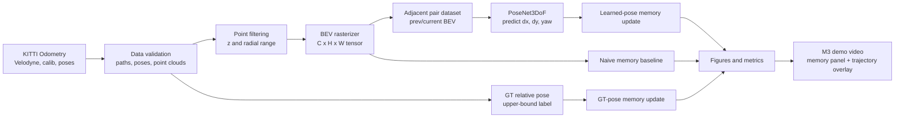
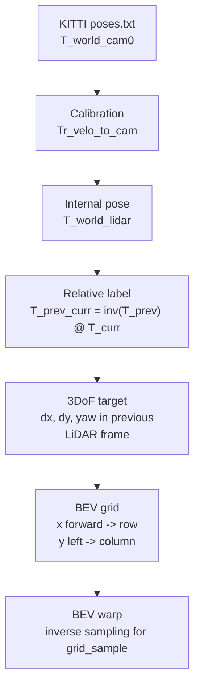

# Architecture Notes

NeuralBEV-LO is a small research prototype for LiDAR odometry and temporal BEV
memory. The v0.1 scope is intentionally narrow: KITTI Odometry input,
density/height/intensity BEV tensors, a lightweight 3DoF PoseNet, and metrics
that compare learned-pose memory against simple baselines.

## Pipeline

## Coordinate System

The BEV grid uses x as forward distance and y as left distance. Tensor shape is
`[C, H, W]`, where H indexes x bins and W indexes y bins. The ego vehicle is not
assumed to be at the image center because the default x range starts at `0m`.

## Implemented Components

- `neuralbev_lo/data/kitti_dataset.py` loads KITTI Odometry in either merged or
  official split layout.
- `neuralbev_lo/data/pose_utils.py` converts KITTI camera poses into internal
  LiDAR poses and builds adjacent relative labels.
- `neuralbev_lo/bev/rasterizer.py` converts `float32[N,4]` point clouds into
  BEV tensors with density, height, and intensity channels.
- `neuralbev_lo/bev/memory.py` updates naive, GT-pose, and learned-pose BEV
  memories.
- `neuralbev_lo/models/posenet.py` defines the lightweight 3DoF PoseNet.
- `neuralbev_lo/eval/odometry_metrics.py` and `neuralbev_lo/eval/bev_metrics.py`
  save odometry and BEV consistency metrics.
- `scripts/build_bev_memory_demo.py` is the main end-to-end demo command.
- `scripts/build_m3_demo_video.py` packages the memory panel and trajectory
  overlay into the Week 11 demo MP4.

## Out Of Scope

The current v0.1 scope does not include sparse convolution backbones, loop
closure, map optimization, ROS integration, semantic labels, or custom CUDA
kernels. Learned-pose results are smoke-scale and documented as weaker than the
GT-pose upper bound and often weaker than naive memory.
