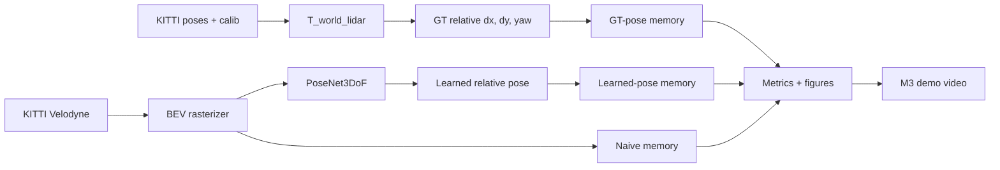
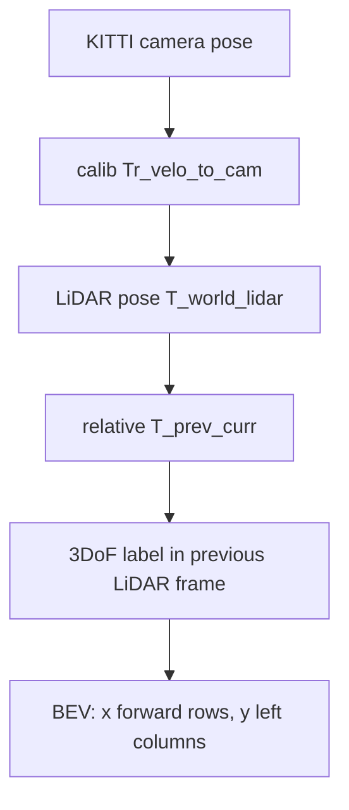

# M3 Demo and Technical Report

## Summary

NeuralBEV-LO v0.1 is a KITTI Odometry research prototype for streaming BEV
memory. It demonstrates data loading, BEV rasterization, GT-pose memory,
lightweight learned relative-pose inference, learned-pose memory comparison,
odometry metrics, BEV consistency metrics, runtime logging, and a short M3 demo
video.

This report intentionally treats the learned checkpoint as smoke-scale. It is
useful for proving the pipeline is connected and measurable, not for claiming
production odometry quality.

## Reproducible Commands

```powershell
python scripts/build_bev_memory_demo.py --config configs/eval/kitti_cpu_smoke_safe.yaml --train-config configs/train/posenet_3dof.yaml --pose-source learned --checkpoint outputs/checkpoints/week6_kitti_tiny_smoke/posenet_3dof_latest.pt --sequence 07 --frames 5 --data-root data/kitti_odometry --cpu --output-dir outputs/figures/week11_m3_demo --metrics-dir outputs/metrics/week11_m3_demo
python scripts/build_m3_demo_video.py --memory-image outputs/figures/week11_m3_demo/07_000000_000004_memory.png --trajectory-image outputs/figures/week11_m3_demo/07_000000_000004_trajectory.png --output outputs/figures/week11_m3_demo/neuralbev_lo_m3_demo.mp4 --seconds 6 --fps 6 --title "NeuralBEV-LO M3 KITTI seq07 smoke demo"
python -m pytest tests/test_m3_demo_video.py
python -m pytest
```

## M3 Artifacts

- Video: `outputs/figures/week11_m3_demo/neuralbev_lo_m3_demo.mp4`
- Memory panel: `outputs/figures/week11_m3_demo/07_000000_000004_memory.png`
- Trajectory overlay: `outputs/figures/week11_m3_demo/07_000000_000004_trajectory.png`
- Alignment curve: `outputs/figures/week11_m3_demo/07_000000_000004_alignment_curve.png`
- Memory metrics: `outputs/metrics/week11_m3_demo/07_000000_000004_memory_metrics.json`
- Consistency metrics: `outputs/metrics/week11_m3_demo/07_000000_000004_consistency_metrics.json`

The generated MP4 has 36 frames at 6 FPS in the local verification run.

## Metrics Snapshot

```text
final occupancy_iou:
  naive: 0.689678
  gt_pose: 1.0
  learned_pose: 0.542051

mean per-frame alignment / flicker:
  naive: alignment 0.744705, flicker 0.001996
  gt_pose: alignment 0.791612, flicker 0.008939
  learned_pose: alignment 0.612804, flicker 0.026458
```

Interpretation: GT-pose memory remains the upper-bound reference. The learned
smoke checkpoint is worse than naive memory on this short KITTI sequence, so the
result should be reported as an honest failure case and reproducibility demo.

## Architecture Diagram



## Coordinate Diagram



## Limitations

- "4D BEV" means a 2D BEV memory evolving over time, not dense `(x, y, z, t)`.
- The learned checkpoint is smoke-scale and does not beat naive memory in the
  M3 demo.
- BEV consistency metrics use density-channel occupancy by default; they are
  engineering indicators, not proof of global map correctness.
- Runtime timings are local diagnostic logs and should not be compared across
  machines without fixed hardware and thread settings.
- `data/`, `outputs/`, and checkpoints are ignored runtime artifacts and are not
  committed to git.
